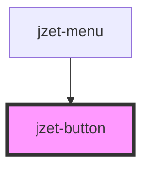

# jzet-button

<!-- Auto Generated Below -->

## Properties

| Property     | Attribute    | Description                                                                                                                                                                                       | Type                                | Default     |
| ------------ | ------------ | ------------------------------------------------------------------------------------------------------------------------------------------------------------------------------------------------- | ----------------------------------- | ----------- |
| `appearance` | `appearance` | The color to use from your application's color palette. Default options are: `"primary"`, `"secondary"`, `"tertiary"`, `"success"`, `"warning"`, `"danger"`, `"light"`, `"medium"`, and `"dark"`. | `string`                            | `'primary'` |
| `disabled`   | `disabled`   | If `true`, the user cannot interact with the button.                                                                                                                                              | `boolean`                           | `false`     |
| `expand`     | `expand`     | Set to `"block"` for a full-width button.                                                                                                                                                         | `"block" \| "default"`              | `undefined` |
| `fill`       | `fill`       | Set to `"minimal"` for a transparent button, to `"outline"` for a transparent button with a border, or to `"solid"`. The default style is `"solid"`                                               | `"minimal" \| "outline" \| "solid"` | `'solid'`   |

## Dependencies

### Used by

 - [jzet-menu](../jzet-menu)

### Graph

----------------------------------------------

*Built with [StencilJS](https://stenciljs.com/)*
