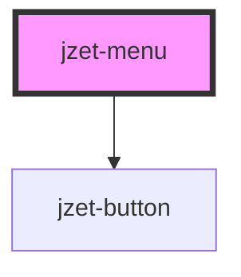

# jzet-menu

<!-- Auto Generated Below -->

## Properties

| Property         | Attribute          | Description                                                                                                                                                                                       | Type                            | Default     |
| ---------------- | ------------------ | ------------------------------------------------------------------------------------------------------------------------------------------------------------------------------------------------- | ------------------------------- | ----------- |
| `alignMenu`      | `align-menu`       | Sets the position of the menu in relation to the menu button. Default: `"right"`. Options: `"left"`, `"center"`, `"right"`                                                                        | `"center" \| "left" \| "right"` | `'right'`   |
| `appearance`     | `appearance`       | The color to use from your application's color palette. Default options are: `"primary"`, `"secondary"`, `"tertiary"`, `"success"`, `"warning"`, `"danger"`, `"light"`, `"medium"`, and `"dark"`. | `string`                        | `'primary'` |
| `menuButtonFill` | `menu-button-fill` | Set to `"minimal"` for a transparent button, to `"outline"` for a transparent button with a border, or to `"solid"`. The default style is `"outline"`                                             | `"outline"`                     | `'outline'` |
| `menuIcon`       | `menu-icon`        | Set a menu icon as string for the menu button. Default: `"->"`;                                                                                                                                   | `string`                        | `'->'`      |
| `menuLabel`      | `menu-label`       | Set a label text for the menu button. Default: `"Menu"`                                                                                                                                           | `string`                        | `'Menu'`    |
| `visible`        | `visible`          | If attribute is set to `"true"` menu is visible.                                                                                                                                                  | `boolean`                       | `false`     |

## Dependencies

### Depends on

- [jzet-button](../jzet-button)

### Graph

----------------------------------------------

*Built with [StencilJS](https://stenciljs.com/)*
