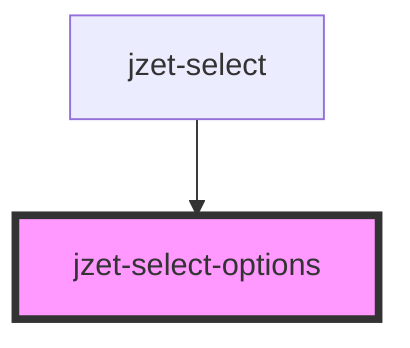

# jzet-select-options

<!-- Auto Generated Below -->

## Properties

| Property            | Attribute             | Description                                                                                                                                                                                       | Type      | Default        |
| ------------------- | --------------------- | ------------------------------------------------------------------------------------------------------------------------------------------------------------------------------------------------- | --------- | -------------- |
| `appearance`        | `appearance`          | The color to use from your application's color palette. Default options are: `"primary"`, `"secondary"`, `"tertiary"`, `"success"`, `"warning"`, `"danger"`, `"light"`, `"medium"`, and `"dark"`. | `string`  | `'primary'`    |
| `disabled`          | `disabled`            | If `true`, the user cannot interact with the select.                                                                                                                                              | `boolean` | `undefined`    |
| `itemLabelProperty` | `item-label-property` | Set the property for the items to define as label. Default: "label"                                                                                                                               | `string`  | `'label'`      |
| `itemValueProperty` | `item-value-property` | Set the property for the items to define as value. Default: "value"                                                                                                                               | `string`  | `'value'`      |
| `items`             | --                    | An array of items to choose from                                                                                                                                                                  | `any[]`   | `undefined`    |
| `mode`              | `mode`                | Set the light or dark mode.                                                                                                                                                                       | `string`  | `'light-mode'` |
| `value`             | `value`               | The selected value                                                                                                                                                                                | `string`  | `undefined`    |
| `visible`           | `visible`             | Determines, whether the options are visible or not                                                                                                                                                | `boolean` | `undefined`    |

## Events

| Event          | Description                                | Type               |
| -------------- | ------------------------------------------ | ------------------ |
| `itemSelected` | Event is being emitted when value changes. | `CustomEvent<any>` |

## Dependencies

### Used by

 - [jzet-select](../jzet-select)

### Graph

----------------------------------------------

*Built with [StencilJS](https://stenciljs.com/)*
