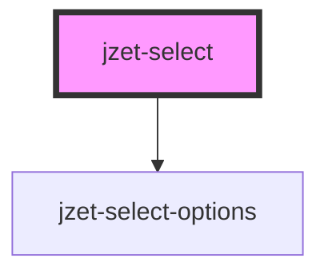

# jzet-select

<!-- Auto Generated Below -->

## Properties

| Property            | Attribute             | Description                                                                                                                                                                                       | Type                   | Default     |
| ------------------- | --------------------- | ------------------------------------------------------------------------------------------------------------------------------------------------------------------------------------------------- | ---------------------- | ----------- |
| `appearance`        | `appearance`          | The color to use from your application's color palette. Default options are: `"primary"`, `"secondary"`, `"tertiary"`, `"success"`, `"warning"`, `"danger"`, `"light"`, `"medium"`, and `"dark"`. | `string`               | `'primary'` |
| `disabled`          | `disabled`            | If `true`, the user cannot interact with the select.                                                                                                                                              | `boolean`              | `undefined` |
| `expand`            | `expand`              | Set to `"block"` for a full-width button.                                                                                                                                                         | `"block" \| "default"` | `undefined` |
| `itemLabelProperty` | `item-label-property` | Set the property for the items to define as label. Default: "label"                                                                                                                               | `string`               | `'label'`   |
| `itemValueProperty` | `item-value-property` | Set thte property for the itmes to define as value. Default: "value"                                                                                                                              | `string`               | `'value'`   |
| `items`             | --                    | An array of items to choose from.                                                                                                                                                                 | `any[]`                | `undefined` |
| `placeholder`       | `placeholder`         | Optional placeholder if no value is selected.                                                                                                                                                     | `string`               | `undefined` |
| `value`             | `value`               | The selected value of the combobox                                                                                                                                                                | `string`               | `undefined` |

## Events

| Event          | Description                                    | Type                      |
| -------------- | ---------------------------------------------- | ------------------------- |
| `focusGained`  | Event is being emitted when input gets focus.. | `CustomEvent<FocusEvent>` |
| `focusLost`    | Event is being emitted when focus gets lost.   | `CustomEvent<FocusEvent>` |
| `itemSelected` | Event is being emitted when value changes      | `CustomEvent<any>`        |

## Dependencies

### Depends on

- [jzet-select-options](../jzet-select-options)

### Graph

----------------------------------------------

*Built with [StencilJS](https://stenciljs.com/)*
